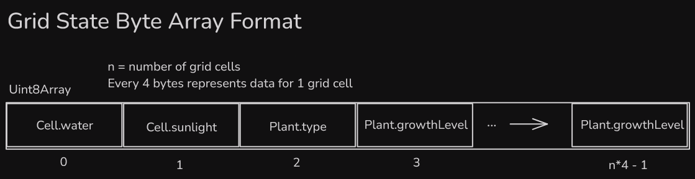

# F1 Devlog

 by CMPM 121 - Group 33
- Jalen Suwa
- Brian Chung
- Dylan Boyer
- Jonathan Cheng
- Marvel McDowell

# How we satisfied the software requirements

## [F0.a]

**Requirements**: You control a character moving over a 2D grid.

Same as last week

## [F0.b]

**Requirements**: You advance time manually in the turn-based simulation.

Same as last week

## [F0.c]

**Requirements**: You can reap or sow plants on grid cells only when you are near them.

Same as last week

## [F0.d]

**Requirements**: Grid cells have sun and water levels. The incoming sun and water for each cell is somehow randomly generated each turn. Sun energy cannot be stored in a cell (it is used immediately or lost) while water moisture can be slowly accumulated over several turns.

Same as last week

## [F0.e]

**Requirements**: Each plant on the grid has a distinct type (e.g. one of 3 species) and a growth level (e.g. “level 1”, “level 2”, “level 3”).

Same as last week

## [F0.f]

**Requirements**: Simple spatial rules govern plant growth based on sun, water, and nearby plants (growth is unlocked by satisfying conditions).

Same as last week

## [F0.g]

**Requirements**: A play scenario is completed when some condition is satisfied (e.g. at least X plants at growth level Y or above).

Same as last week

## [F1.a]

**Requirements**: The important state of your game's grid must be backed by a single contiguous byte array in AoS or SoA format.

The grid state contains “structs” of 4 byte values for each grid square. The Cell interface takes two of those bytes and as water and sunlight number values (max values of 5 and 3, respectively), and the Plant interface takes the other two as the plant type (a number converted to an enum value between 0-255 inclusive and used to index into an array) and the growth level number (max value of three). There are as many of these 4 byte groups as there are grid squares.

## [F1.b]

**Requirements**: The player must be able to manually save their progress in the game.

The grid state array is converted to a base64 encoded string. The game statistics are a Map (with number or Map<string,number> values) where the Maps are converted into arrays of array pairs of their respective [key, value] types. The current player position object and day count number, are all packaged into an object of the interface Checkpoint. Checkpoints are pushed onto a history array. An object of the interface SaveData includes two properties: the game config object and the history array. SaveData objects are serialized as JSON and saved to localStorage under “save_<slot_name>”. The players can manually save and load to and from string-named slots. The load reinitializes the game with the state from the latest Checkpoint object in the saved history (including decoding the base64 grid state) and pulling the config from the saved config object.

## [F1.c]

**Requirements**: The game must implement an implicit auto-save system to support recovery from unexpected quits.

At the beginning of each turn (day), the game automatically creates Checkpoints that are pushed to history. It will also automatically create a save as described in f1.b under the “auto” slot (keyed as “save_auto” in local storage, overwriting if one exists already). When the game is loaded, it checks for a save in this slot and asks the player if they want to continue from that save. The auto slot is visible in the load save menu.

## [F1.d]

**Requirements**: The player must be able to undo every major choice (all the way back to the start of play), even from a saved game.

We decided to count each turn (day) as a “major choice” so that we could combine the undo/redo history and autosave functionality into one simpler system. The saves store an entire history array of Checkpoints that act as snapshots of the game state to allow undoing from a save game back to the start which are loaded into the StateManager on a save load. This means the player can currently undo by moving back to checkpoints in history taken at the beginning of each day when the player presses the “Finish Day” button and plant update calculations have been completed for the day. The redo will move forward again through that same history if they had used undo, but not if they pressed “Finish Day” again (this starts rewriting the history starting from the current checkpoint). One feature of this hybrid system is that saving manually creates another checkpoint on the same day as the last autosave meaning you can use undo at a more granular level having multiple saves in one day.

# Reflection

Looking back on how we achieved the new F1 requirements, our team's plan has evolved significantly. Initially, we did not consider the complexity of implementing a contiguous byte array for the grid state. This requirement pushed us to rethink our data structures and optimize memory usage. We also had to enhance our save and load mechanisms to support multiple save slots and auto-save functionality. Our game design has evolved to provide more feedback to the player, such as prompts for auto-save recovery and visual indicators for undo and redo actions. These changes have improved the overall user experience and made the game more robust. However, we look forward to further improving player feedback due to player inputs which we believe will be easier on the alternate interface platform we will be switching to. Our roles have also shifted slightly, with team members taking on new responsibilities to address these additional requirements. This experience has reinforced the importance of adaptability and collaboration in game development.
